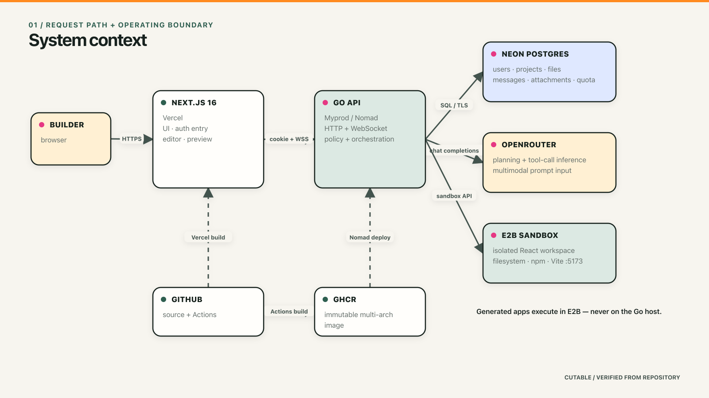

# Cutable

Cutable is an AI web-app builder. A Next.js workspace lets users describe an
application, while a Go API plans and executes the work with OpenRouter inside
isolated E2B sandboxes. Generated files are indexed in PostgreSQL and streamed
to the browser over WebSockets.

This repository is a Go backend migration and Cutable rebrand of the original
Likeable project. The UI was retained and modernized; the former
Node/Express/Prisma/LangGraph backend was replaced with a dependency-light Go
service.

## What is included

- Go 1.26 HTTP and WebSocket API
- JWT authentication in secure, HttpOnly cookies
- Optional Google OAuth 2.0 sign-in with state validation and PKCE
- PostgreSQL persistence with embedded SQL migrations
- OpenRouter chat completions with function/tool calling
- Secured E2B sandbox lifecycle, filesystem, command, build, and preview support
- Two account-level demo builds followed by session-only bring-your-own-provider keys
- Next.js 16, React 19, Tailwind CSS 4, React Query, and Monaco Editor
- A reproducible `cutable-react-base` E2B template
- Unit tests, live provider smoke tests, dependency audits, and GitHub Actions CI

## Prerequisites

- Go 1.26 or newer
- Node.js 22 or newer and npm
- Docker with Compose
- An OpenRouter API key with available credits
- An E2B API key with available credits

## Local setup

1. Create the protected environment file:

   ```sh
   cp .env.example .env
   chmod 600 .env
   ```

2. Fill in `OPENROUTER_API_KEY`, `OPENROUTER_MODEL`, `E2B_API_KEY`, and a
   random `JWT_SECRET` of at least 32 characters. Do not commit `.env`.

   To enable Google sign-in, create a Google OAuth client of type **Web
   application**, add
   `http://localhost:3010/api/auth/google/callback` as an authorized redirect
   URI, then set `GOOGLE_CLIENT_ID` and `GOOGLE_CLIENT_SECRET`. Keep the client
   secret only in `.env` or a production secret manager.

3. Install the two JavaScript dependency sets:

   ```sh
   npm ci --prefix apps/frontend
   npm ci --prefix apps/backend
   ```

4. Start PostgreSQL:

   ```sh
   docker compose up -d postgres
   ```

5. Start the Go API in one terminal:

   ```sh
   npm run dev:backend
   ```

6. Start the frontend in another terminal:

   ```sh
   npm run dev:frontend
   ```

Open <http://localhost:3000>. The API health endpoint is
<http://localhost:3010/healthz>.

The Go service loads the repository-root `.env` automatically during local
development. Production deployments should inject environment variables from
their secret manager instead.

## E2B template

Cutable uses the alias in `E2B_TEMPLATE_ALIAS`, which defaults to
`cutable-react-base`.

Build or update the production template:

```sh
npm --prefix apps/backend run build-template
```

Build a separate development alias:

```sh
npm --prefix apps/backend run build-template-dev
```

Template builds and live sandboxes consume E2B credits. Agent runs consume the
OpenRouter credits associated with the configured model.

## Verification

```sh
npm test
npm run lint
npm run build
npm audit --prefix apps/frontend
npm audit --prefix apps/backend
```

The E2B live integration test is opt-in. Supply an existing running sandbox ID;
the test reconnects securely and never logs its access token:

```sh
cd apps/backend
E2B_LIVE_SANDBOX_ID=your-sandbox-id go test ./internal/provider \
  -run TestE2BLiveFilesystemAndCommand -v
```

## Architecture



The [architecture handbook](docs/architecture/README.md) continues from this
context view into the user journey, AI execution loop, trust boundaries,
deployment path, data model, and a claim-to-code verification map. Every
diagram is supplied as an editable Excalidraw scene plus PNG and SVG exports.

The API does not persist E2B environment access tokens. It receives a fresh
short-lived credential whenever it creates or reconnects to a sandbox.
User-supplied OpenRouter and E2B keys are held in browser `sessionStorage`,
sent only with build or preview requests, and are not stored by the Go API.

## Environment variables

See [.env.example](.env.example) for the complete list. `OPENROUTER_MODEL` is
required intentionally; there is no hidden fallback model. For HTTPS
deployments set `COOKIE_SECURE=true`, use an HTTPS `FRONTEND_ORIGIN`, and use a
`wss://` frontend WebSocket URL. Set `GOOGLE_REDIRECT_URL` to the exact
production API callback URL registered in Google Cloud.

The backend container reads an optional `/run/secrets/cutable.env` file before
normal environment variables. The image is published to GHCR for both AMD64
and ARM64 with immutable commit tags and digests.

## Repository layout

```text
apps/
  backend/
    cmd/server/          Go entrypoint
    internal/            agent, providers, API, config, and PostgreSQL store
    e2b/                 E2B template definition and build scripts
    migrations/          readable SQL migration copies
  frontend/              Next.js application
compose.yaml             local PostgreSQL
```

## Attribution

Reimplemented from the original Likeable codebase with permission. Cutable’s
Go migration, provider integrations, security hardening, and rebranding are
maintained in this repository.
