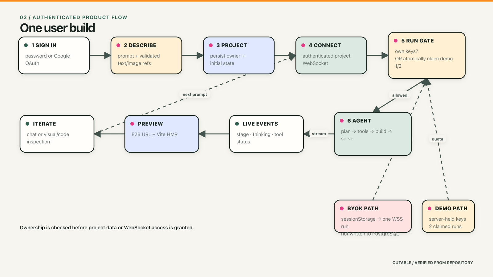
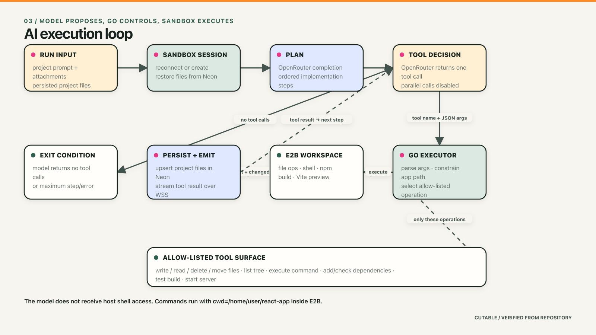
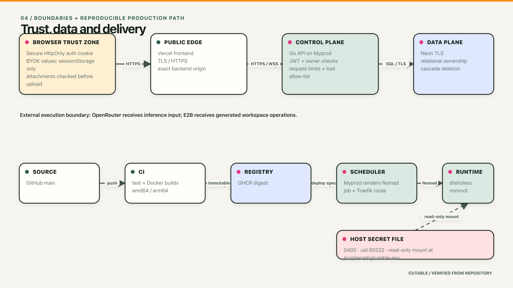

# Cutable architecture

This is a code-backed system map, not a proposed architecture. Each material
claim links to the implementation that currently enforces it. The diagrams are
generated from one scene definition:

```sh
node scripts/generate-architecture-diagrams.mjs
```

Open any `.excalidraw` file in [Excalidraw](https://excalidraw.com) to edit it.
The matching PNG is for Markdown and the SVG is for the product documentation.

## 01 — System context


The browser renders the Next.js application on Vercel. All durable product
state and authorization decisions pass through the Go API deployed by Myprod.
The API coordinates three external systems:

- Neon stores users, projects, attachments, conversations, generated files,
  sandbox identifiers, and demo usage.
- OpenRouter returns plans and function calls. It does not execute tools.
- E2B hosts the generated React workspace and executes file, package, build,
  and preview commands.

Generated application code never executes in the Vercel frontend or the Go
container.

## 02 — One user build



1. A password login or Google OAuth callback creates the same HttpOnly JWT
   session.
2. The API validates the prompt and attachments before one database
   transaction creates the project.
3. The WebSocket handshake parses the project ID, checks user ownership, and
   restricts the accepted origin.
4. A run uses a complete OpenRouter + E2B key pair or atomically claims one of
   the account’s two demo runs.
5. Stage, thinking, tool, build, file, and completion events stream back over
   the authenticated socket.
6. The E2B preview remains separately addressable while the generated source
   is persisted in Neon.

BYOK credentials are held in browser `sessionStorage`, sent in the run message,
used to construct providers for that run, and never passed to a store method.
They still travel through the Go process and the respective providers; this is
session-only handling, not end-to-end provider encryption.

## 03 — AI execution loop



The control split is deliberate:

| Layer | Authority |
| --- | --- |
| OpenRouter model | Proposes the plan, tool name, and JSON arguments |
| Go runner | Parses arguments, selects a registered tool, constrains file paths, controls step/time limits, persists results |
| E2B | Executes filesystem and shell operations inside `/home/user/react-app` |
| Neon | Preserves project state independently of sandbox lifetime |
| Browser | Observes events and renders the source/preview; it does not execute the agent |

`execute_command` is intentionally powerful inside E2B. The security boundary
is sandbox isolation, app-directory execution, request timeout, and the absence
of a host-shell path—not a shell-command allowlist.

### Tool surface

```text
write_file          write_multiple_files
read_file           delete_file           rename_file
list_directories    execute_command
add_dependency      check_missing_dependencies
test_build          start_dev_server
```

The model loop is serial: `parallel_tool_calls=false`. Each tool result is
appended to the model conversation before the next completion. A run ends when
the model returns no tool call, an operation fails irrecoverably, the maximum
step count is reached, or the agent timeout expires.

## 04 — Trust and delivery



### Runtime boundaries

- Auth cookies are `HttpOnly`, configurable `Secure`, and `SameSite=Lax`.
- Project reads and WebSocket upgrades include the authenticated user ID in
  the ownership query.
- WebSocket origins are reduced to the configured frontend host.
- Generated paths are normalized and rejected if they escape the React root.
- Image content is checked from decoded bytes, not only filename or MIME label.
- Provider and database secrets live in a mode `0400` host file, mounted
  read-only into the nonroot backend container.

### Delivery path

```text
Git push
  ├─ Vercel: apps/frontend → Next.js build → edge deployment
  └─ GitHub Actions: Docker buildx → GHCR digest
                                  → Myprod application spec
                                  → Nomad allocation
                                  → Traefik HTTPS route
```

The backend image is a statically linked Go binary copied into Distroless and
runs as `nonroot`. CI publishes AMD64 and ARM64 images with a commit tag and an
immutable digest.

## Data model

```text
users
  1 ─── * projects
           ├── * project_attachments
           ├── * conversations
           └── * project_files (unique project_id + path)
```

The project is the ownership aggregate. Child records use foreign keys with
cascade deletion. `demo_runs_used` belongs to the user because the allowance
is account-level, not project-level.

## Verification map

| Claim | Enforcement / evidence |
| --- | --- |
| Project access is owner-scoped | [`Store.Project`](../../apps/backend/internal/store/store.go), HTTP and WebSocket handlers |
| Demo claims are atomic | [`Store.ClaimDemoRun`](../../apps/backend/internal/store/store.go), `UPDATE … WHERE demo_runs_used < limit RETURNING` |
| BYOK is per-run and not persisted | [`websocket.go`](../../apps/backend/internal/httpapi/websocket.go), provider construction occurs in the socket handler |
| Generated file paths stay under the app root | [`safePath`](../../apps/backend/internal/agent/agent.go) |
| Tool execution happens in E2B | [`Runner.executeTool`](../../apps/backend/internal/agent/agent.go), [`provider/e2b.go`](../../apps/backend/internal/provider/e2b.go) |
| OpenRouter emits serial tool calls | [`provider/openrouter.go`](../../apps/backend/internal/provider/openrouter.go), `ParallelToolCalls: false` |
| Files survive sandbox replacement | [`Runner.ensureSandbox`](../../apps/backend/internal/agent/agent.go) restores `project_files` |
| Migrations run at service startup | [`cmd/server/main.go`](../../apps/backend/cmd/server/main.go) and embedded store migrations |
| Attachments are size/type/content checked | [`validateAttachments`](../../apps/backend/internal/httpapi/server.go) |
| Password and Google auth converge on one cookie | [`server.go`](../../apps/backend/internal/httpapi/server.go), [`google_oauth.go`](../../apps/backend/internal/httpapi/google_oauth.go) |
| Backend is nonroot and multi-architecture | [`Dockerfile`](../../apps/backend/Dockerfile), [`publish-backend.yml`](../../.github/workflows/publish-backend.yml) |

## Known boundaries

- E2B and OpenRouter are third-party processors and receive the data required
  for their roles.
- Conversation and file persistence is relational; there is no collaborative
  merge protocol or version-control history for generated files.
- Demo usage is a run allowance, not a token or compute budget.
- Sandbox preview availability follows E2B lifetime and successful Vite
  startup.
- The model may generate insecure application code. E2B isolates execution,
  but it is not a substitute for reviewing generated code before deployment.

## Diagram inventory

| View | Editable | Export |
| --- | --- | --- |
| System context | [`system-context.excalidraw`](diagrams/system-context.excalidraw) | [PNG](diagrams/system-context.png) · [SVG](diagrams/system-context.svg) |
| User build flow | [`user-build-flow.excalidraw`](diagrams/user-build-flow.excalidraw) | [PNG](diagrams/user-build-flow.png) · [SVG](diagrams/user-build-flow.svg) |
| AI execution loop | [`ai-agent-loop.excalidraw`](diagrams/ai-agent-loop.excalidraw) | [PNG](diagrams/ai-agent-loop.png) · [SVG](diagrams/ai-agent-loop.svg) |
| Trust and delivery | [`trust-and-delivery.excalidraw`](diagrams/trust-and-delivery.excalidraw) | [PNG](diagrams/trust-and-delivery.png) · [SVG](diagrams/trust-and-delivery.svg) |
